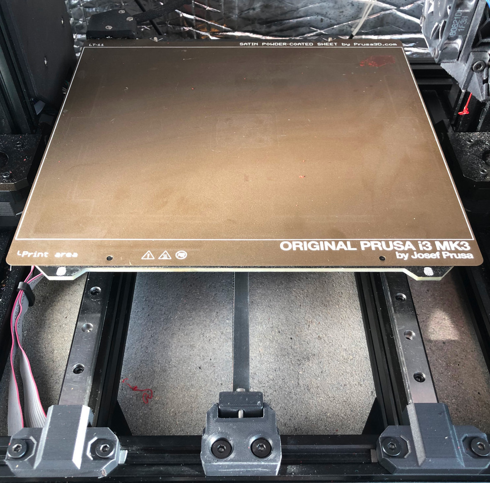

# bear_on_rail
Modification for the Prusa MK3s bear to use linear rails. Model based on 
[Prusa Bear Linear rail modification with single rail x axis](https://www.printables.com/model/30729-prusa-bear-linear-rail-modification-with-single-ra) and the [Prusa Bear Upgrade](https://github.com/gregsaun/prusa_i3_bear_upgrade)

## Y Axis
The Y axis uses a 9mm belt with a 20 teeth pulley. This means that the Y Belt holder had to be modified and the Belt path moved up to accomodate the larger pulley. It also uses 2 MGN12 rails with 3 MGN12H carriages.  

